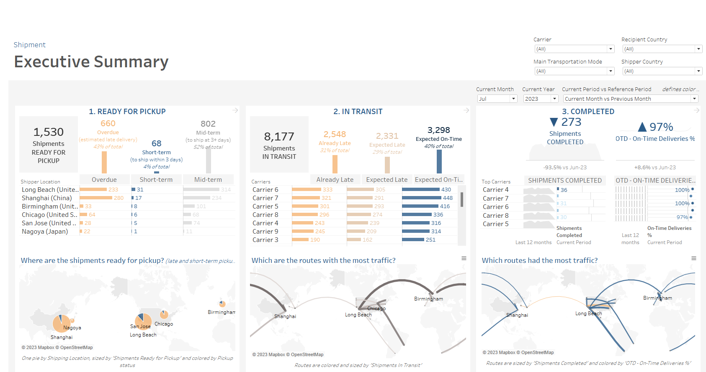
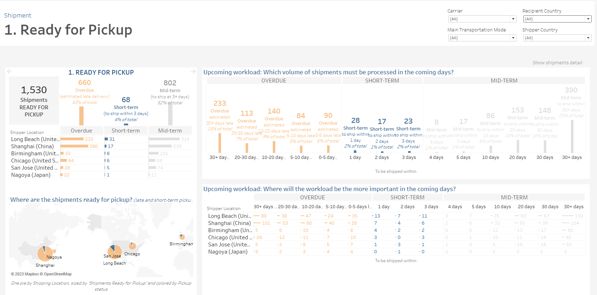
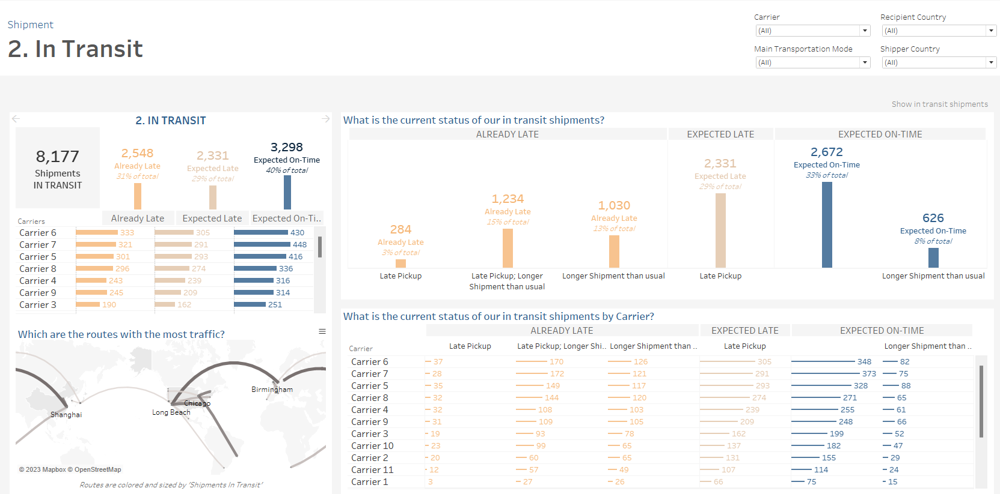
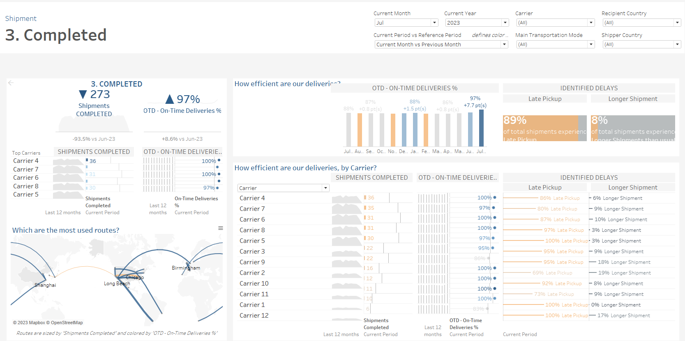

# Supply-Chain-Shipment-Inventory-Dashboards

## Project Overview

This project utilizes supply chain and shipment data sourced from Salesforce. Salesforce serves as the primary repository for our data, containing critical information related to various aspects of our supply chain operations.

### Data Source

The datasets used in this project are specifically related to our supply chain and shipment operations. The data stored in Salesforce includes details on shipments, logistics, inventory, and other relevant supply chain information. This dataset is crucial for monitoring, analyzing, and optimizing our supply chain processes.

## Data Processing

I process and analyze the supply chain and shipment data using Tableau. Tableau is a powerful data visualization and analytics tool that allows us to gain insights into our logistics, track performance, and make data-driven decisions. With Tableau, we can create interactive dashboards and reports tailored to our supply chain needs.

### Data Flow

1. Data Extraction: Supply chain and shipment data is extracted from Salesforce using the Salesforce API, data export, etc.

2. Data Transformation: Data is cleaned, transformed, and prepared for analysis. This may involve consolidating data from multiple sources or aggregating it for meaningful insights.

3. Data Visualization: Tableau is used to create interactive dashboards and reports based on the processed supply chain and shipment data.

